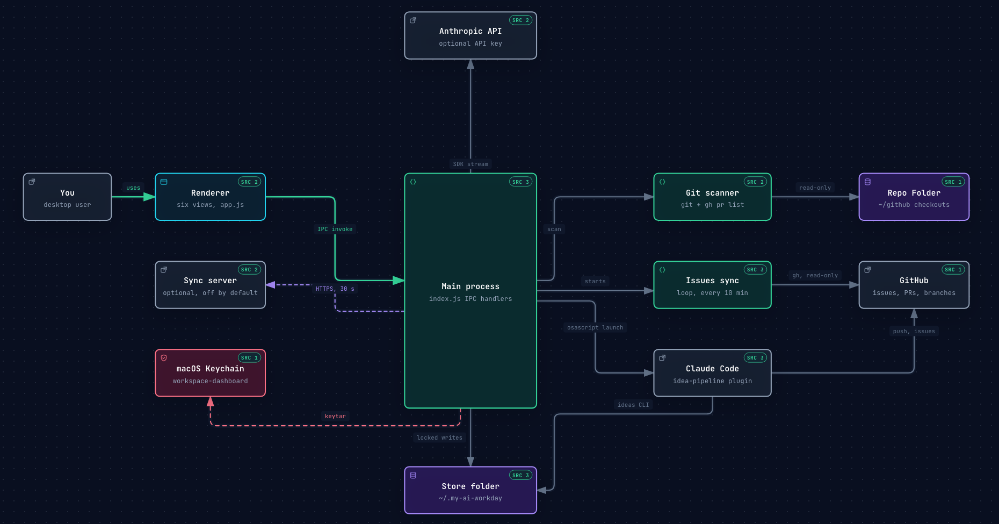
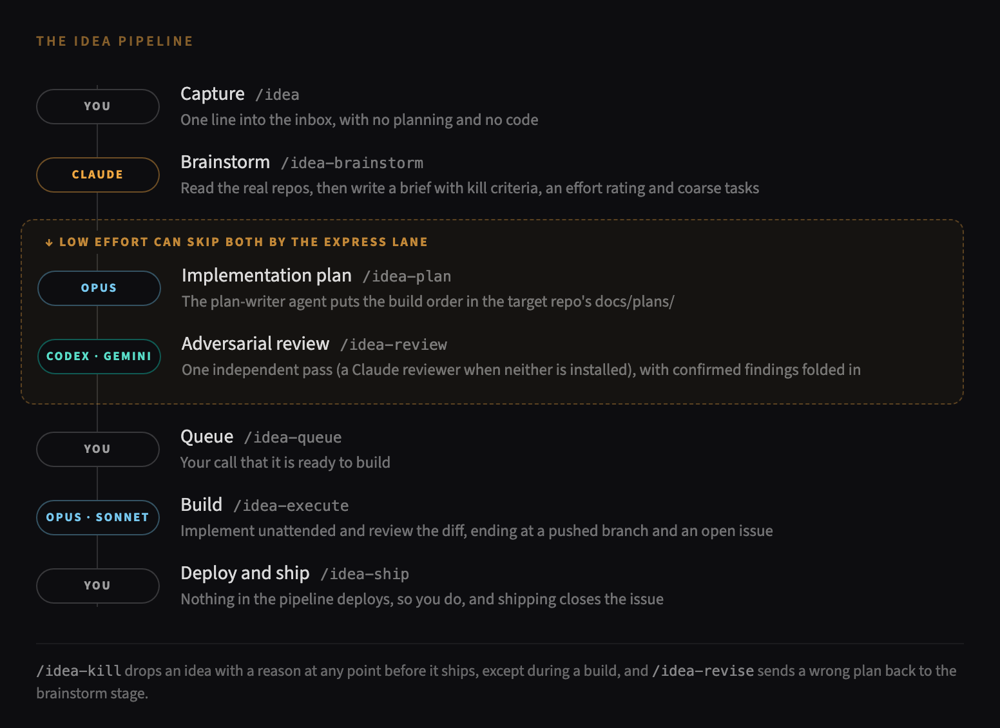

# My AI Workday

I work on more than a dozen projects at a time, most of them with AI sessions committing changes faster than I can review them, and by the end of a week I had lost track of which repositories held uncommitted work or a branch that never merged. Ideas came in just as fast and ended up scattered across notes I never went back to, so I needed one place to see the state of every project and a way to capture an idea in a few seconds without stopping what I was doing.

My AI Workday is a macOS desktop app that groups the git repositories you add from one folder into project cards and scans each of them. Each card shows what needs attention, covering uncommitted changes, commits not yet pushed, branches holding work the default branch lacks and worktrees holding files that exist nowhere else, with an age on each signal so a week-old stray branch stands out from this morning's edits. The app also keeps an Ideas board for a capture-to-ship pipeline that can hand each stage to Claude Code.


## Views

The View menu lists six views, each on its own shortcut and on a tab under the header, and the app reopens on whichever one you last had open.

| View | Shortcut | What it shows |
|------|----------|---------------|
| Dashboard | Cmd+1 | Project cards with repo status and age pills, tasks, Today, the inbox, the Work · Personal · All scope switch, and a rollup on each card of open issues, PRs and ideas in flight. |
| Ideas | Cmd+2 | A board from inbox to shipped, with keyboard triage and an action for each stage. |
| Issues | Cmd+3 | Issues and pull requests across a project's repos, read through the local `gh` CLI into the store folder's `issues/` directory and never written. |
| Lists | Cmd+4 | Free-standing checklists that are not tied to a project. |
| Timeline | Cmd+5 | Commits, session-log issues, PRs and idea moves by week, read from local git and the issue store. |
| Summary | Cmd+6 | Stat tiles, charts and a repo health table over the same sources. |


Cmd+N opens quick capture, Cmd+I adds an idea, Cmd+R rescans the repositories and Cmd+, opens Settings. The Weekly and Briefing buttons in the header need an Anthropic API key.

## What it never does

Push, Commit and the ship action copy a shell command to the clipboard for you to run, and nothing in the app deploys anything, so the app itself never writes to your repositories. The one thing it starts is a Terminal or iTerm window running a Claude Code slash command from a fixed list (`ACTIONS` in `src/main/terminal.js`), opened in a worktree named for the idea after the idea id has been validated, and Claude Code still asks before it touches a file.

## Architecture

The Electron main process sits at the center, taking IPC calls from the renderer, reading your checkouts and GitHub through read-only `git` and `gh`, keeping secrets in the Keychain, and writing its own state to the store folder, which the Claude Code plugin also writes through the `ideas` CLI. `docs/ARCHITECTURE.md` covers the stores, the sync protocol and the write boundary in detail.



## Requirements

- An Apple silicon Mac on macOS 13 or later. The build targets arm64 only.
- Xcode Command Line Tools, for `git`.
- Node 22, which is what CI runs.
- The GitHub CLI, signed in with `gh auth login`, for the Issues view and PR rows, and to tell a squash-merged branch from a forgotten one. Without it those parts show a note that `gh` is not installed or not on PATH, and the rest of the app works.
- Optional: an Anthropic API key, for Briefing, Weekly, commit message suggestions and task breakdown.
- Optional: Claude Code, for the Ideas board's stage skills and launch buttons. The skills ship in this repository as a Claude Code plugin, described under Claude Code skills below.

## Download

The [latest release](https://github.com/michaeldpj/my-ai-workday/releases/latest) has a DMG for Apple silicon Macs. Open it and drag My AI Workday into Applications. The app is ad-hoc signed and not notarized, so the first launch stops with a dialog saying Apple could not verify it. Click Done, open System Settings, go to Privacy & Security, and click Open Anyway beside the message about My AI Workday, which asks for your password once and opens the app from then on. Running `xattr -dr com.apple.quarantine "/Applications/My AI Workday.app"` in Terminal does the same thing without the dialog.

## Build from source

```bash
git clone https://github.com/michaeldpj/my-ai-workday.git
cd my-ai-workday
npm install
npm test
npm run dev          # builds and opens the app
npm run build        # ad-hoc signed app at release/mac-arm64/My AI Workday.app
npm run install-app  # build, copy to /Applications, clear the quarantine flag
npm run dist         # ad-hoc signed DMG at release/My AI Workday-<version>-arm64.dmg
```

`npm run dev` and the installed app read and write the same store folder, so anything you do in one shows up in the other.

Recent npm releases skip dependency install scripts until you approve them, and `npm install` then warns that electron, esbuild, keytar and fsevents have install scripts that are not yet approved. Without those scripts Electron has no binary, and `npm test` and `npm run dev` fail with "Electron failed to install correctly". Run `npm install-scripts approve electron esbuild keytar fsevents` and then `npm rebuild` to fix it.

## First run

Settings opens on its own the first time the app starts, and after that from Cmd+,.

| Field | What it does |
|-------|--------------|
| Anthropic API Key | Optional. Stored in the macOS Keychain under the service `workspace-dashboard`. Leaving it blank on a later save keeps the stored key. |
| Repo Folder | The folder holding your checkouts, `~/github` by default. It must exist, be written as `~/…` or `/…`, and use only letters, digits, dot, dash or underscore in each part of the path, so a folder with a space in its name is refused. |
| Personal Claude Folder | Optional. A second Claude Code config folder, which adds a work/personal toggle to the Ideas bar. |
| Dashboard Link | Optional `https://` link for the header's Dashboard button, which stays hidden while this is empty. |
| Store Folder | Read-only. Where the app and the ideas CLI keep their state, `~/.my-ai-workday` unless `MY_AI_WORKDAY_HOME` is set or a store from the app's earlier name already sits at `~/.my-day`. `node scripts/ideas.mjs home` prints the same path. |
| Sync Server URL | Optional. Leaving it empty keeps sync off. |
| Sync Token | Bearer token for the sync server, stored in the Keychain. |
| Ideas Publish Token | Optional separate token for publishing the ideas projection, stored in the Keychain. Falls back to the Sync Token. |
| Work Projects | A checkbox per card, marking which cards count as Work for the scope switch. Empty until you have cards. |

The dashboard starts empty. Name a card in the dashed New card tile at the end of the grid, type a repository from your Repo Folder into its Add a repo field, and press Scan.


## Off by default

- Sync. With no Sync Server URL the workspace loop never starts, the ideas loop reports itself unconfigured without making a request, and the header's sync dot reads disconnected.
- Ideas launch buttons. A stage's launch button appears when its skill exists at `<config folder>/skills/<name>/SKILL.md`, or when that config folder has the `idea-pipeline` plugin installed at user scope and enabled. Each card's copy button, which puts the same command on the clipboard, is there either way.
- Ideas history in git. Ideas save to `ideas.json` in the store folder either way, and are committed only after `node scripts/ideas.mjs init` makes the store folder a git repository. Nothing is pushed unless you add a remote yourself.
- AI features. Without a key the per-repo AI, focus suggest, task breakdown and Analyze Statuses buttons are hidden, and Briefing and Weekly open with "Set your API key in Settings (⌘,) to use AI features."

## Claude Code skills

This repository doubles as a Claude Code marketplace named `my-ai-workday`, and its one plugin, `idea-pipeline`, holds fourteen skills, five agents, the `ideas` command (put on PATH inside sessions) and a hook that asks once for a session record after a session pushes. The skills take an idea from capture through brainstorm, plan, review, execute and ship, and they read and write the same store the Ideas board shows.



From the folder where you cloned this repository, install it with two commands.

```bash
claude plugin marketplace add "$PWD"
claude plugin install idea-pipeline@my-ai-workday
```

Plugin skills are invoked with the plugin's name in front, as `/idea-pipeline:idea`, `/idea-pipeline:idea-brainstorm` and so on, and a skill of the same name in your own `~/.claude/skills` takes precedence over the plugin's.

Installing copies the plugin into Claude Code's plugin cache under a version taken from the clone's current commit, so after a `git pull` run `claude plugin marketplace update my-ai-workday` and then `claude plugin update idea-pipeline@my-ai-workday`, and start a new session. The same repository also works as a GitHub marketplace through `claude plugin marketplace add <owner>/<repo>`, which updates with the same two commands.

The Ideas bar's work and personal toggle reads whichever config folder is selected, so installing for the personal CLI means running both install commands with `CLAUDE_CONFIG_DIR` set to that folder.

The skills find projects through `ideas projects`, which lists the cards on your dashboard, and find repositories through `ideas root`, which prints the Repo Folder from Settings, so add a card before the first `/idea-pipeline:idea-brainstorm`.

The skills need Node, git and `gh` signed in, and `/idea-pipeline:idea-review` can also use the Codex or Gemini CLI as an independent reviewer when one is installed. `/idea-pipeline:idea-execute` and `/idea-pipeline:session-issue` need each repository to be a git clone whose `origin` is on GitHub. The store keeps no history until `ideas init` makes its folder a git repository, and adding a private remote there backs it up.

## Data

Everything lives in the store folder, which is `~/.my-ai-workday` on a fresh install, whatever folder `MY_AI_WORKDAY_HOME` names, or `~/.my-day` when that already holds a store from the app's earlier name. The Store Folder row in Settings shows which one is in use. The folder holds `my-day-config.json` (settings and workspace), `ideas.json` (the ideas store, written only through `scripts/ideas-store.mjs` under a lock) and `issues/<repo>.json` (the local copy of each repository's issues and PRs). Three Keychain items sit under the service `workspace-dashboard`, and deleting the store folder along with those items resets the app.

The ideas CLI works on the same store from a terminal, and `node scripts/ideas.mjs --help` lists its commands. Inside a Claude Code session with the plugin installed, the same CLI is the `ideas` command.

## Uninstall

Quit the app, then remove it along with the Electron profile that holds its window state and view preferences.

```bash
rm -rf "/Applications/My AI Workday.app"
rm -rf ~/Library/Application\ Support/My\ AI\ Workday
```

If you installed the Claude Code plugin, these two commands remove it and its marketplace, and running them again with `CLAUDE_CONFIG_DIR` set removes it from any personal config folder you installed it into.

```bash
claude plugin uninstall idea-pipeline@my-ai-workday
claude plugin marketplace remove my-ai-workday
```

The store folder holds your ideas, cards and issue copies, so back it up first if you want to keep them, and a remote you added after `ideas init` keeps that history either way. Check the Store Folder row in Settings before deleting, and put that path in place of `~/.my-ai-workday` when it shows a different folder.

```bash
rm -rf ~/.my-ai-workday
security delete-generic-password -s workspace-dashboard -a anthropic-api-key
security delete-generic-password -s workspace-dashboard -a sync-token
security delete-generic-password -s workspace-dashboard -a ideas-publish-token
```

Each `security` command reports that the item could not be found when that key or token was never saved, which is harmless. Worktrees that Claude Code made for the launch buttons stay inside your repositories under `.claude/worktrees/`, and uninstalling does not remove them.

## Companions

A sync server and a phone app exist as separate, optional projects that are not published here. `docs/ARCHITECTURE.md` documents the protocol the desktop speaks to them.

## License

MIT, see `LICENSE`.
