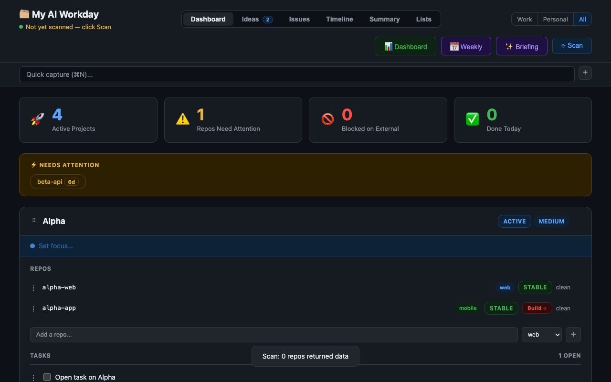
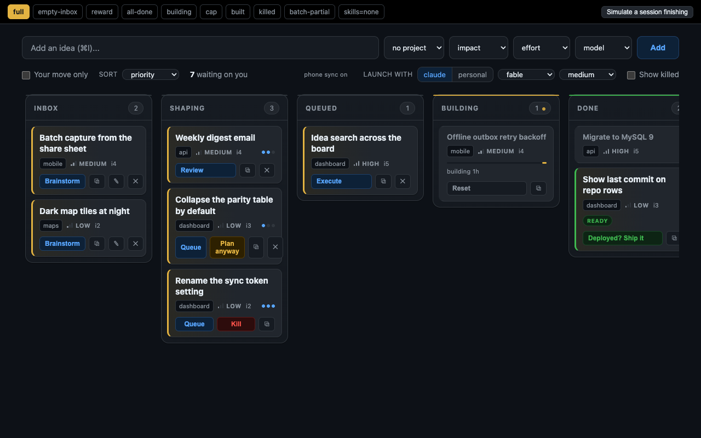
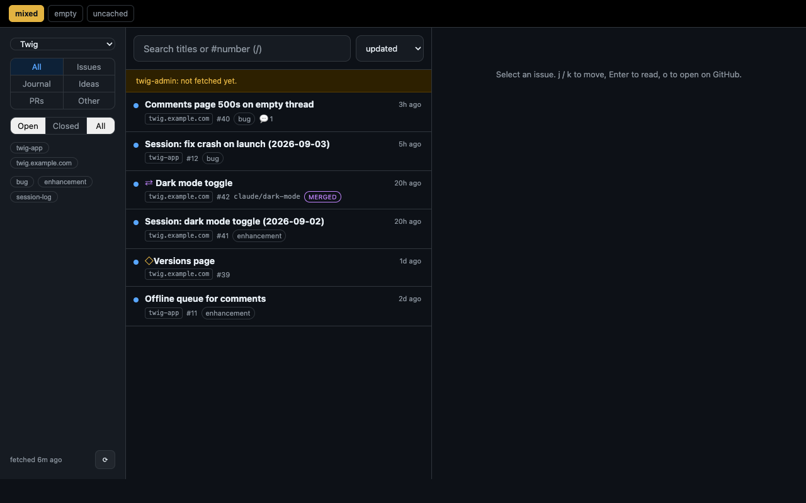
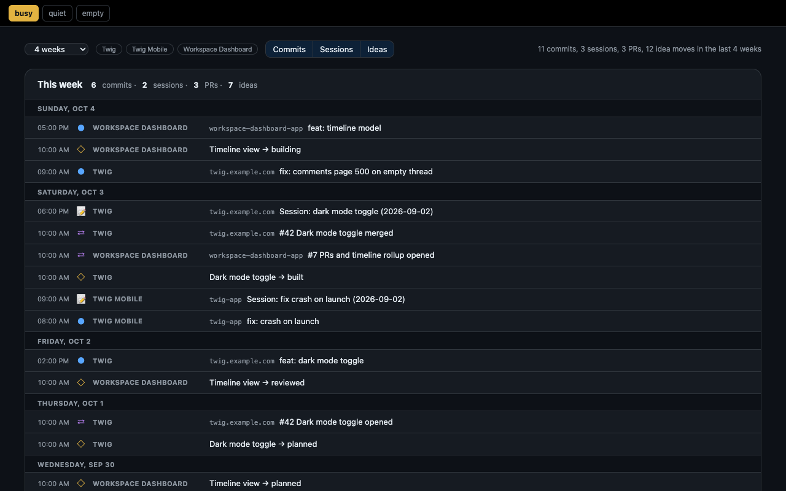
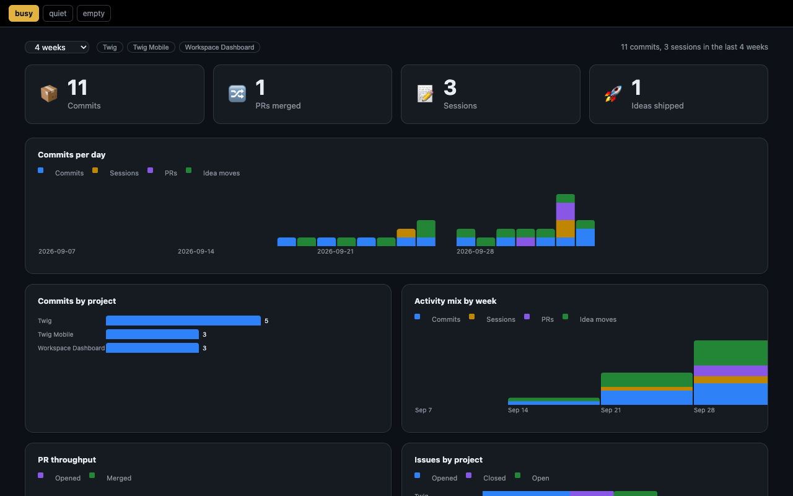
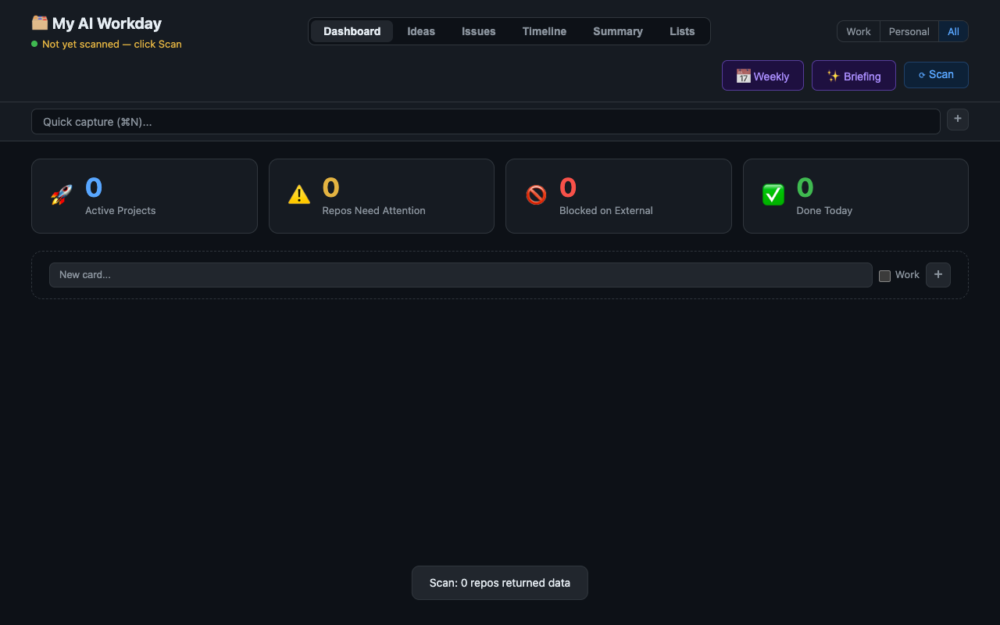

# My AI Workday

My AI Workday is a macOS desktop app that groups the git repositories you add from one folder into project cards and scans each of them. Each card shows what needs attention, from uncommitted changes and commits not yet pushed to branches holding work the default branch lacks and worktrees holding files that exist nowhere else, with an age on each signal so a week-old stray branch stands out from this morning's edits. The app also keeps an Ideas board for a capture-to-ship pipeline that can hand each stage to Claude Code.



## Views

The View menu lists six views, each on its own shortcut and on a tab under the header, and the app reopens on whichever one you last had open.

| View | Shortcut | What it shows |
|------|----------|---------------|
| Dashboard | Cmd+1 | Project cards with repo status and age pills, tasks, Today, the inbox, the Work · Personal · All scope switch, and a rollup on each card of open issues, PRs and ideas in flight. |
| Ideas | Cmd+2 | A board from inbox to shipped, with keyboard triage and an action for each stage. |
| Issues | Cmd+3 | Issues and pull requests across a project's repos, read through the local `gh` CLI into the store folder's `issues/` directory and never written. |
| Lists | Cmd+4 | Free-standing checklists that are not tied to a project. |
| Timeline | Cmd+5 | Commits, session-log issues, PRs and idea moves by week, read from local git and the issue store. |
| Summary | Cmd+6 | Stat tiles, charts and a repo health table over the same sources. |









Cmd+N opens quick capture, Cmd+I adds an idea, Cmd+R rescans the repositories and Cmd+, opens Settings. The Weekly and Briefing buttons in the header need an Anthropic API key.

## What it never does

The app never writes to your repositories. Push, Commit and the ship action copy a shell command to the clipboard for you to run, and nothing in the app deploys anything. The one thing it starts is a Terminal or iTerm window running a Claude Code slash command from a fixed list (`ACTIONS` in `src/main/terminal.js`), opened in a worktree named for the idea after the idea id has been validated, and Claude Code still asks before it touches a file.

## Requirements

- An Apple silicon Mac on macOS 13 or later. The build targets arm64 only.
- Xcode Command Line Tools, for `git`.
- Node 22, which is what CI runs.
- The GitHub CLI, signed in with `gh auth login`, for the Issues view, PR rows, and telling a squash-merged branch from a forgotten one. Without it those parts show a note that `gh` is not installed or not on PATH, and the rest of the app works.
- Optional: an Anthropic API key, for Briefing, Weekly, commit message suggestions and task breakdown.
- Optional: Claude Code, with stage skills named `idea-brainstorm`, `idea-plan`, `idea-review`, `idea-execute`, `idea-ship`, `idea-reset`, `idea-revise` and `idea-reopen`, for the Ideas board's launch buttons. Those skills are not part of this repository.

## Build from source

```bash
git clone https://github.com/michaeldpj/my-ai-workday.git
cd my-ai-workday
npm install
npm test
npm run dev          # builds and opens the app
npm run build        # unsigned app at release/mac-arm64/My AI Workday.app
npm run install-app  # build, copy to /Applications, clear the quarantine flag
```

The built app is unsigned and arm64 only. `npm run dev` and the installed app read and write the same store folder, so anything you do in one shows up in the other.

Recent npm releases skip dependency install scripts until you approve them, and `npm install` then warns that electron, esbuild, keytar and fsevents have install scripts not yet covered. Without those scripts Electron has no binary, and `npm test` and `npm run dev` fail with "Electron failed to install correctly". Run `npm install-scripts approve electron esbuild keytar fsevents` and then `npm rebuild` to fix it.

## First run

Settings opens on its own the first time the app starts, and after that from Cmd+,.

| Field | What it does |
|-------|--------------|
| Anthropic API Key | Optional. Stored in the macOS Keychain under the service `workspace-dashboard`. Leaving it blank on a later save keeps the stored key. |
| Repo Folder | The folder holding your checkouts, `~/github` by default. It must exist and be written as `~/…` or `/…`. |
| Personal Claude Folder | Optional. A second Claude Code config folder, which adds a work/personal toggle to the Ideas bar. |
| Dashboard Link | Optional `https://` link for the header's Dashboard button, which stays hidden while this is empty. |
| Store Folder | Read-only. Where the app and the ideas CLI keep their state, `~/.my-ai-workday` unless `MY_AI_WORKDAY_HOME` is set. `node scripts/ideas.mjs home` prints the same path. |
| Sync Server URL | Optional. Leaving it empty keeps sync off. |
| Sync Token | Bearer token for the sync server, stored in the Keychain. |
| Ideas Publish Token | Optional separate token for publishing the ideas projection, stored in the Keychain. Falls back to the Sync Token. |
| Work Projects | A checkbox per card, marking which cards count as Work for the scope switch. Empty until you have cards. |

The dashboard starts empty. Name a card in the dashed New card tile at the end of the grid, type a repository from your Repo Folder into its Add a repo field, and press Scan.



## Off by default

- Sync. With no Sync Server URL the workspace loop never starts, the ideas loop reports itself unconfigured without making a request, and the header's sync dot reads disconnected.
- Ideas launch buttons. A stage's launch button appears only when its skill exists at `<config folder>/skills/<name>/SKILL.md`. Each card's copy button, which puts the same command on the clipboard, is there either way.
- Ideas history in git. Ideas save to `ideas.json` in the store folder either way, and are committed only after `node scripts/ideas.mjs init` makes the store folder a git repository. Nothing is pushed unless you add a remote yourself.
- AI features. Without a key the per-repo AI, focus suggest, task breakdown and Analyze Statuses buttons are hidden, and Briefing and Weekly open with "Set your API key in Settings (⌘,) to use AI features."

## Data

Everything lives in the store folder, which is `~/.my-ai-workday` on a fresh install or whatever folder `MY_AI_WORKDAY_HOME` names. It holds `my-day-config.json` (settings and workspace), `ideas.json` (the ideas store, written only through `scripts/ideas-store.mjs` under a lock) and `issues/<repo>.json` (the local copy of each repository's issues and PRs). Three Keychain items sit under the service `workspace-dashboard`, and deleting the store folder along with those items resets the app.

The ideas CLI works on the same store from a terminal, and `node scripts/ideas.mjs --help` lists its commands.

## Companions

A sync server and a phone app exist as separate, optional projects that are not published here. `docs/ARCHITECTURE.md` documents the protocol the desktop speaks to them.

## License

MIT, see `LICENSE`.
