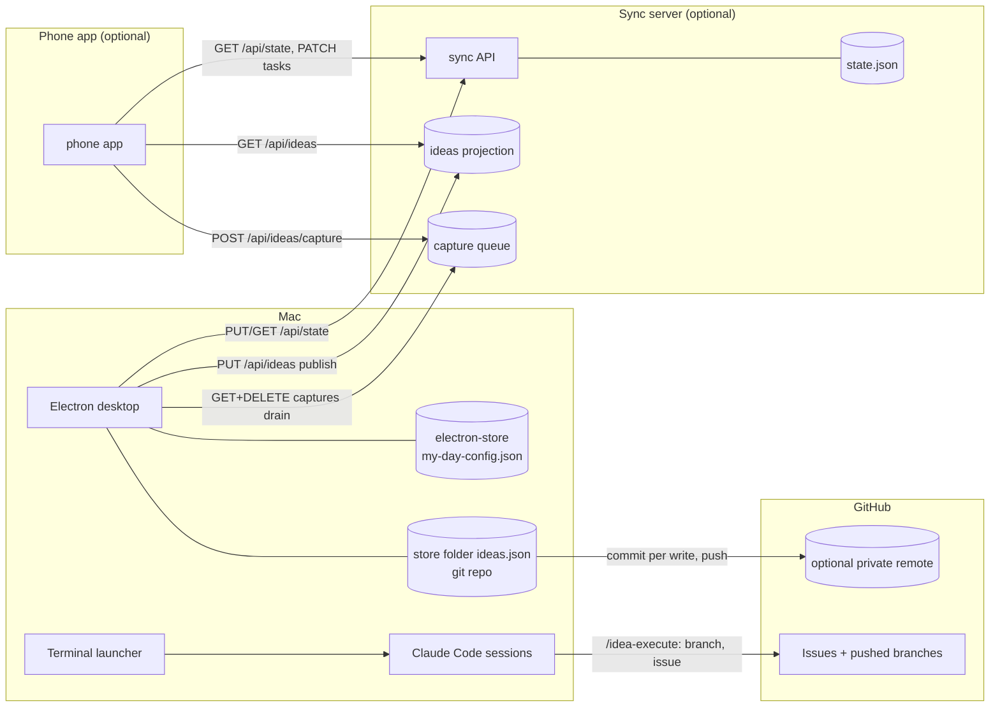

# My AI Workday: Architecture

My AI Workday is a desktop app on the Mac that owns all of its state. Two
optional companions live outside this repository, a sync server and a phone
app, and this document describes them only by the protocol the desktop speaks,
since anyone can run or replace them.

## Components

| Component | Repo | Runs on | Role |
|-----------|------|---------|------|
| Desktop | this repository | Mac (Electron) | Primary surface. Git scanning, projects/tasks, Ideas board, AI features, terminal launcher. Owner of all state. |
| Stage skills | this repository, `plugin/` | Claude Code | The idea-pipeline plugin: stage skills, agents, the `ideas` CLI and a session-log hook. Writes the ideas store only through the CLI. |
| Sync server (optional) | not in this repository | any host the user runs | HTTP server implementing the endpoints below. Mirror and mailbox, never an authority. |
| Phone app (optional) | not in this repository | phone | Read-mostly dashboard plus quick capture. |

## Two state stores, deliberately separate

### Workspace state

Projects, repos, tasks, lists, today and inbox live in electron-store on the
Mac, in `my-day-config.json`, and are mirrored to `state.json` on the sync
server. All three clients read and write it, and the desktop and the server
both do full-object replacement, so it is treated as a low-stakes store where
a lost update costs a task toggle, not a decision.

### The ideas store

`ideas.json` in the store folder holds the pipeline's state and is handled
with far more care. The store folder is `~/.my-ai-workday` unless
`MY_AI_WORKDAY_HOME` names another, and `scripts/store-dir.mjs` is the one
place that rule lives, shared by the app and the CLI. Every write goes through
`scripts/ideas-store.mjs` under an exclusive lock. The folder becomes a git
repository only after `node scripts/ideas.mjs init`, which runs `git init`
there, and from then on each write is one commit, made only when `<store>/.git`
exists (`commitLocal` in `scripts/ideas-store.mjs`). A push follows,
best-effort and outside the lock, only when the user has added an upstream.
The Mac is the sole authority. The sync server never holds the brief, the
plan, the review verdict, or the history, only a narrow projection for
rendering cards on the phone.

The idea-pipeline plugin carries the same store modules in `plugin/lib`, copied from `scripts/`, so a Claude Code session and the app always resolve the same store folder.

The two stores share the store folder and nothing else.
`my-day-config.json` is gitignored inside the ideas repo.

## Sync flows (desktop main process)

Two independent loops share one server URL and the Keychain tokens. While the
Sync Server URL setting is empty, `startSync` in `src/main/sync.js` returns
before starting its timer, and the ideas loop's tick stops at its config check
and reports `unconfigured` without making a request.

### Workspace loop

`src/main/sync.js` pulls `GET /api/state?since=<version>` every 30 s and on
window load, and pushes the full workspace via `PUT /api/state` on a 2 s
debounce after every save. A 409 sets `syncStatus = 'conflict'` and nothing
else, no merge and no retry. This weakness is why ideas do not ride in the
state envelope. A pull whose workspace fails `validateWorkspace`
(`src/renderer/workspace-model.js`) is refused whole: nothing is saved, the
version does not move, and `syncStatus` becomes `'rejected'` with the reason.
The window's saves go through the same validator.

### Ideas loop

`src/main/ideas-sync.js`, wrapping `scripts/ideas-sync.mjs`, runs every 30 s
and 2 s after any local idea mutation, in two steps.

1. Drain. `GET /api/ideas/captures`, write each capture through the locked
   store path as a new `inbox` idea carrying `sourceCaptureId`, then
   `DELETE` to ack by id. Delivery is at-least-once on purpose, since the
   write happens before the ack and `sourceCaptureId` makes a replay a no-op.
   Each tick takes at most 25 captures so the synchronous git commits do not
   stall the main process. Malformed rows are acked anyway to avoid
   head-of-line blocking.
2. Publish. `PUT /api/ideas` with `{rev, ideas}`, where each idea is
   projected down to id, title, stage, projectId, impact, effort, planEffort,
   waitingOn, nextAction, killedReason, and timestamps. The last publish wins
   on the sync server, and the server never mints a rev.

Sync health (`idle | unconfigured | ok | unreachable | error`, plus the
pending capture count) is pushed to the renderer on the `ideas:sync` channel.
The indicator exists because the workspace loop once failed silently for four
months.

## Sync server protocol

Bearer token on everything except `/api/health`.

| Method | Path | Purpose |
|--------|------|---------|
| GET | `/api/health` | Liveness, no auth |
| GET/PUT | `/api/state` | Workspace mirror, version check, 409 on mismatch |
| PATCH | `/api/inbox`, `/api/today`, `/api/task` | Granular workspace mutations from the phone |
| GET | `/api/projects`, `/api/projects/:id` | Read-only project views |
| GET | `/api/ideas?since=N` | Projection + pending capture count |
| PUT | `/api/ideas` | Mac publishes the projection |
| POST | `/api/ideas/capture` | Phone enqueues a capture. Closed field allowlist `{title, notes, projectId, impact, effort}`, unknown keys refused, 429 at 200 pending |
| GET/DELETE | `/api/ideas/captures` | Mac drains and acks by id |

A conforming server runs all idea mutations through a single op queue holding
the whole read-modify-write span. A capture is not an idea, and it becomes one
only when the Mac drains it through the validated store path, so the phone
can never move a card or smuggle a stage.

## GitHub touchpoints

GitHub appears in six places.

1. The ideas store remote. If the user adds a private remote to the store
   folder, every stage transition is pushed to it best-effort.
2. Sessions write constantly. `/idea-execute` opens the tracking issue,
   appends its decision log (each entry tagged mechanical or taste, so the
   judgment calls can be read first), and pushes the branch. `/idea-ship` closes the
   issue. All of this happens inside Claude Code sessions, not in the app.
3. The board links out. A `built` card links to its issue.
4. The scanner reads PR state. During a scan the app runs `gh pr list`
   (read-only, local CLI) for repos that have unmerged branches, so a
   squash-merged branch is not reported as forgotten work.
5. The Issues view reads issues and pull requests into a local store. A
   background loop walks every repo every ten minutes, except repos marked
   as upstream clones (someone else's project kept on a card), which also
   stay out of the rollup counts, the Timeline, the Summary's activity
   figures and the weekly digest, and whose files refresh only when their
   card's Issues tab opens. Their status still shows everywhere. The first pull for a
   repo takes its full issue and PR history (read-only, local `gh` CLI,
   `gh issue list` and `gh pr list`), and every pull after asks only for rows
   updated since the last successful fetch, merging by number into one JSON
   file per repo under the store folder's `issues/`. A failed fetch changes
   nothing on disk, so the view always has the last good copy to show even
   when `gh` is down. Opening the Issues tab reads those files rather than
   calling `gh` itself. Rows classify into Journal, Ideas, PRs, or Other from
   data the app already has (the rail's Issues kind is every kind but PRs,
   matching the dashboard rollup's count), and the pane renders issue and
   comment bodies through the same escape-first markdown module the briefing
   uses.
6. The Timeline reads commit history. The Timeline tab (Cmd+5) runs `git log --all`
   (read-only, local CLI) across every repo but upstream clones to place commits on a
   week-by-week timeline alongside session-log issues and PR rows from the
   local issue store and idea stage transitions. This is local and read-only
   like the rest of this list, and not a GitHub call, but it is included here
   because it is the third read the app does.

Apart from pushing the ideas store to a remote the user added, the app never
writes GitHub, and nothing from GitHub flows into the ideas store.

## The write boundary

The app copies shell commands to the clipboard and never writes to any repo.
The one amendment is that the Ideas board may open a Terminal or iTerm window
running an enumerated Claude Code slash command (`src/main/terminal.js`). The
launcher accepts an action key from a frozen map plus a regex-validated idea
id, never a command string, takes its model from a fixed alias list or from a pinned-id list that a per-stage policy resolves to, resolves the stage to one of two fixed forms (its bare name for a skill in the config folder's `skills/`, or `idea-pipeline:<name>` for one from a user-scope, enabled plugin install, reading the plugin records only to check that a skill file exists), applies shell quoting before AppleScript quoting,
and resolves the repo path with realpath strictly beneath the configured Repo
Folder. Claude Code prompts before touching files, so the app starts sessions
but authors nothing. Nothing in the system deploys, because `/idea-execute`
ends at push and `built` waits for a human.

## Known limits

Recorded here so the docs do not oversell the system.

- PR state requires the `gh` CLI and covers only repos with unmerged branches.
  Without gh, squash-merged branches read as unmerged.
- A local branch that will never merge (a permanent scratch or pages branch)
  can be marked ignored from the status picker. The repo stops counting it as
  unmerged work until it is watched again the same way.
- The store re-reads inside the lock but has no caller-held rev compare, so a
  read-think-write sequence has last-write-wins semantics per field.
- A repo's first issue pull takes about half a minute for a large history,
  so a repo added to the workspace shows no issues until its first sync
  loop tick completes.
- An issue deleted or transferred to another repo on GitHub stays in its
  local file until the next full pull, which happens only on a repo's first
  fetch or after a store format change (`mergeRows` with `full`). Delta
  fetches only merge what `gh` returns.
